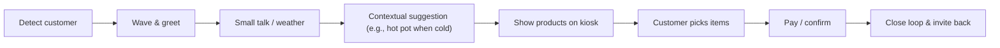
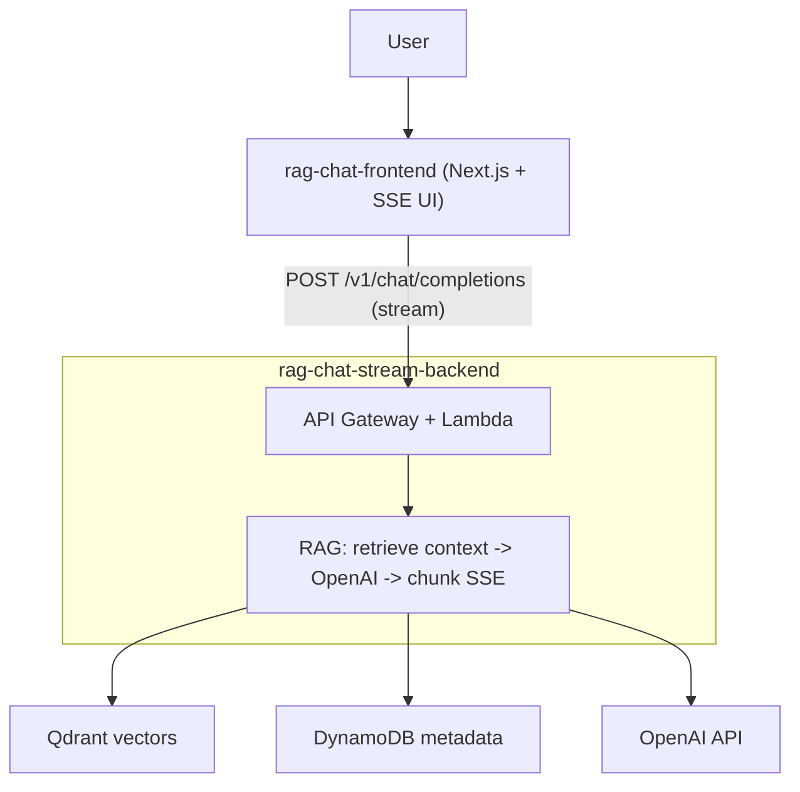
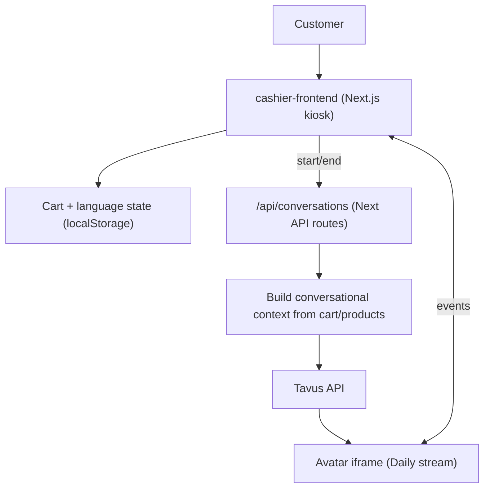
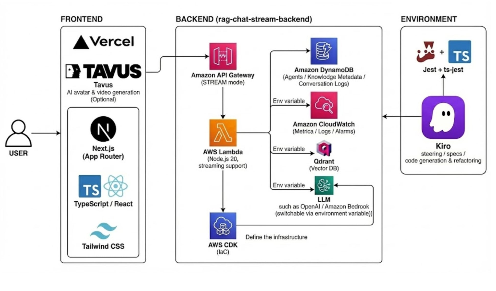
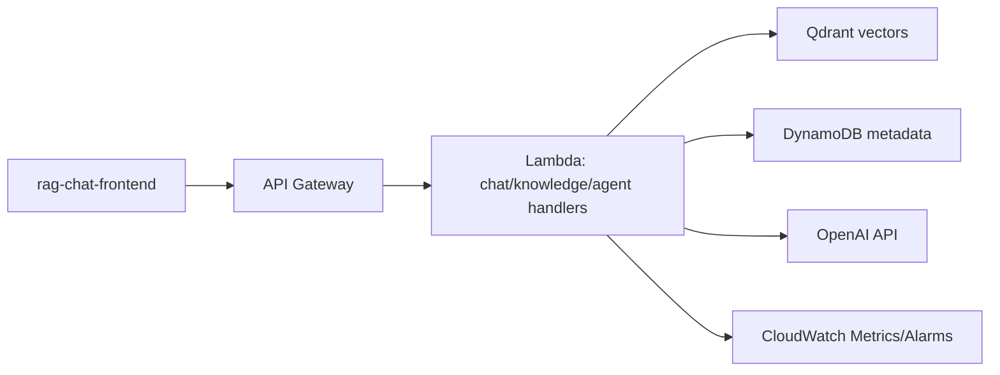

# ai-crew

Monorepo of demo applications that combine generative AI, RAG, and avatar/voice experiences. Includes a product-recommendation chat app, an OpenAI-compatible streaming backend, and a cafe self-order kiosk UI.

## Highlights

- OpenAI-compatible RAG backend with SSE and API key/bearer auth
- Product-recommendation chat UI with Markdown upload → vectorization → streaming answers
- Cafe self-order kiosk with Tavus avatar concierge and bilingual UI (JA/EN)
- AWS CDK IaC, Qdrant vector search, DynamoDB metadata, CloudWatch metrics
- Ready-to-run quickstart for the product demo

## Demo Video

[](https://www.youtube.com/watch?v=DaMnjfSflDg)

## Inspiration

> "We get nervous when store clerks talk to us, but we also want someone to recommend things."

Shoppers want guidance without pressure. Human clerks can feel pushy; unmanned kiosks feel cold. AI-Crew aims to "become friends first" using a warm avatar that chats casually (even about the weather), balancing labor reduction with customer satisfaction.

## What it does

- **Active sensing:** Camera detects nearby shoppers; the avatar waves and initiates contact ("Hello! Shopping for dinner today?").
- **Ice-breaking → suggestions:** Starts with small talk ("It's cold today") and naturally shifts to recommendations ("Hot pot soup base is on sale").
- **Friendly UI:** Anime-style or 3D character with expressive face/voice to stay approachable and avoid the uncanny valley.



## How we built it

- **Category fit:** Entered the "Frankenstein" theme—stitched disparate parts into one AI kiosk experience.
- **Body (UI):** Next.js frontend for ordering and payments.
- **Brain (RAG backend):** `rag-chat-stream-backend` on AWS (API Gateway + Lambda, Qdrant, DynamoDB, OpenAI API), IaC via CDK.
- **Soul (avatars):** AI avatars provide the face/voice and bridge to the user.
- **Lightning rod (Kiro):** `.kiro/steering` for worldview and `.kiro/specs` for requirements; Kiro generated UI components through to Lambda handlers.

## Challenges we ran into

- **3-Tap paradox:** More options usually mean more taps; we grouped decisions tightly to keep flows fast.
- **Conversation vs. UI:** Chat is too slow for ordering, buttons are too dry; we split roles—avatar for ice-break/suggestions, buttons for selection/confirmation.
- **Multimodal consistency:** Kiosk UI, RAG backend, and avatar needed to stay in sync; treating `.kiro/steering` and `.kiro/specs` as the single source of truth kept alignment.

## Accomplishments we're proud of

- Proved AI avatars + self-checkout + AWS RAG + Kiro can operate as one cohesive product.
- Showed Kiro can deliver full-stack output (frontend, CDK/Lambda/Qdrant backend, Jest tests).
- Built a production-ready, serverless architecture beyond a toy prototype.

## What we learned

- Prompts are specifications: detailed Markdown specs in `.kiro/specs` lift quality dramatically.
- Human-AI symphony: humans own experience; Kiro implements—clear roles accelerate delivery.

## What's next for AI-Crew

- Personalized recommendations: greet repeat customers and offer "the usual" or fresh picks.
- Multilingual auto-switching: serve inbound tourists (EN/ZH/etc.).
- POS integration: use real inventory to prioritize overstock/expiring items.
- O2O handoff: QR codes to push coupons to phones after conversations.
- Real-world pilots: deploy in pop-up stores to measure avatar interaction quality.

## Built With (normalized)

- AWS: API Gateway, Lambda (Node.js 20), DynamoDB, CDK
- Qdrant for vector search; OpenAI API for LLM/embeddings
- Next.js (App Router), TypeScript, Tailwind CSS, Jest/RTL, fast-check
- Tavus avatars (Daily iframe) for face/voice concierge
- Vercel/Node for frontend hosting; npm tooling

## Repository Layout

```
.
├── apps/
│   ├── rag-chat-stream-backend/  # OpenAI-compatible RAG backend (AWS Lambda + CDK)
│   ├── rag-chat-frontend/        # Product recommendation chat UI (Next.js)
│   └── cashier-frontend/         # Tavus-powered self-order kiosk UI (Next.js)
├── QUICKSTART_PRODUCT_RECOMMENDATION.md  # End-to-end steps for the product demo
├── FINAL_REPORT.md and other reports
└── .kiro/                        # Specs and project briefs
```

## System Flows (text diagrams)

**Product recommendation (chat)**
```
User
  │
  ▼
rag-chat-frontend (Next.js, SSE UI)
  │  POST /v1/chat/completions (stream=true)
  ▼
API Gateway + Lambda handlers (rag-chat-stream-backend)
  │  RAG pipeline: retrieve context → call OpenAI → chunk SSE
  ▼
Qdrant (vectors) + DynamoDB (agents/knowledge) + OpenAI API
```

**Cafe self-order with Tavus**
```
Customer
  │
  ▼
cashier-frontend (Next.js, kiosk flow)
  │  Local cart + language state + Tavus iframe
  ▼
Next.js API routes /api/conversations (server)
  │  Build conversational_context from cart/products
  ▼
Tavus API → Avatar iframe stream (Daily)
```

**Mermaid diagrams**





**Architecture diagram**



## Quickstart (Product Recommendation Demo)

See `QUICKSTART_PRODUCT_RECOMMENDATION.md` for full steps. Summary:

1) **Prepare the backend**  
```bash
cd apps/rag-chat-stream-backend
npm install
cat > .env <<'EOF'
RAG_STREAM_API_KEY=your-secure-api-key-min-20-chars
OPENAI_API_KEY=sk-...
QDRANT_URL=https://your-qdrant-instance.com
QDRANT_API_KEY=your-qdrant-key
EOF
npm run build
npx cdk deploy --require-approval never   # requires AWS credentials
```

2) **Run the frontend**  
```bash
cd apps/rag-chat-frontend
npm install
cat > .env.local <<'EOF'
NEXT_PUBLIC_API_BASE_URL=https://<api-id>.execute-api.<region>.amazonaws.com/prod
NEXT_PUBLIC_JWT_TOKEN=your-secure-api-key-min-20-chars
EOF
npm run dev   # http://localhost:3000
```

3) **Upload products and chat**  
Upload a product Markdown file via `Knowledge → Create`, create an agent with the product-recommendation preset under `Agents → Create`, then start chatting. API examples and sample Markdown are in the Quickstart.

### Minimal env checklist
- Backend: `RAG_STREAM_API_KEY`, `OPENAI_API_KEY`, `QDRANT_URL`, `QDRANT_API_KEY`
- Frontend: `NEXT_PUBLIC_API_BASE_URL`, `NEXT_PUBLIC_JWT_TOKEN` (match backend key)
- Optional: adjust `SIMILARITY_THRESHOLD`, `TOP_K`, `LLM_MODEL` in backend `.env`

## Applications

### rag-chat-stream-backend (`apps/rag-chat-stream-backend`)
- OpenAI Chat Completions–compatible RAG API with SSE and non-SSE responses.
- Knowledge and agent management backed by Qdrant + DynamoDB.
- AWS Lambda / API Gateway / CDK, with CloudWatch metrics and alarms.
- Key commands: `npm run build`, `npm test`, `npx cdk deploy --require-approval never`.
- API docs: `docs/STREAMING_API.md`; verification: `VERIFICATION_REPORT.md`.

### rag-chat-frontend (`apps/rag-chat-frontend`)
- Next.js 16 product recommendation chat UI: product Markdown upload, agent creation, streaming chat display.
- Connects to the backend via `NEXT_PUBLIC_API_BASE_URL` and `NEXT_PUBLIC_JWT_TOKEN`.
- Key commands: `npm run dev`, `npm test`, `npm run build`.
- Implementation/report references: `IMPLEMENTATION_STATUS.md`, `VALIDATION_REPORT.md`, `SETUP.md`.

### cashier-frontend (`apps/cashier-frontend`)
- Next.js 16 cafe self-order UI with JA/EN toggle and Tavus avatar concierge.
- Main flow: `/cashier/home` → `/cashier/order` → `/cashier/pay` → `/cashier/thanks`; legacy design at `/casher_nomal/*`.
- Configure Tavus with `TAVUS_API_KEY`, `REPLICA_ID`, `PERSONA_ID`, and `NEXT_PUBLIC_TAVUS_*` in `.env.local`.
- Key commands: `npm run dev`, `npm test -- --runInBand`, `npm run build`.
- Notes: cart/language state stored in `localStorage`; allow `*.daily.co` for Tavus iframe.

## Environment Notes

- Node.js 20+ recommended (Next.js apps work on 18+); npm 10+.
- Backend needs AWS credentials, Qdrant endpoint, and an OpenAI API key.
- For Tavus, ensure network/content blockers allow `*.daily.co`.

## ⚠️ Cost Warning

- Using the stack may incur charges from AWS (Lambda, API Gateway, DynamoDB, CloudWatch), OpenAI API, Qdrant, and Tavus/Daily. Review pricing and set budgets/alerts before deploying or running tests.

## AWS Infra Overview (Mermaid)



## Environment Variables (quick reference)

**rag-chat-stream-backend**
| Var | Required | Default | Notes |
| --- | --- | --- | --- |
| `RAG_STREAM_API_KEY` | Yes | - | Bearer/API-key auth (min 20 chars) |
| `OPENAI_API_KEY` | Yes | - | LLM calls |
| `QDRANT_URL` | Yes | - | Qdrant endpoint |
| `QDRANT_API_KEY` | Yes | - | Qdrant auth |
| `COGNITO_USER_POOL_ID` | No | `CREATE_NEW` | Reuse or create |
| `LOG_LEVEL` | No | `INFO` | |
| `EMBEDDING_MODEL` | No | `text-embedding-3-small` | |
| `LLM_MODEL` | No | `gpt-4o` | |
| `SIMILARITY_THRESHOLD` | No | `0.35` | Vector filter |
| `TOP_K` | No | `8` | Retrieval count |

**rag-chat-frontend**
| Var | Required | Default | Notes |
| --- | --- | --- | --- |
| `NEXT_PUBLIC_API_BASE_URL` | Yes | - | Points to backend API |
| `NEXT_PUBLIC_JWT_TOKEN` | Yes | - | Must match backend API key |

**cashier-frontend**
| Var | Required | Default | Notes |
| --- | --- | --- | --- |
| `TAVUS_API_KEY` | Yes (server) | - | Tavus API |
| `TAVUS_API_BASE` | No | `https://tavusapi.com` | |
| `REPLICA_ID`, `PERSONA_ID` | No | - | Server-side defaults for Tavus API calls (cashier-frontend only) |
| `CONTEXT_PROVIDER` | No | `local` | `openai`/`dedalus` supported |
| `OPENAI_API_KEY` | Conditional | - | Required when using OpenAI context builder (cashier-frontend optional path) |
| `NEXT_PUBLIC_TAVUS_*` | Depends | - | Client-side replica/persona/mode |
| `NEXT_PUBLIC_TAVUS_AUTO_START` | No | `false` | Auto-connect iframe |
| `NEXT_PUBLIC_REQUIRE_TAVUS_CONFIG` | No | `true` | Warn on missing config |

## Documentation

- Product demo setup: `QUICKSTART_PRODUCT_RECOMMENDATION.md`
- App-specific docs: `apps/rag-chat-stream-backend/README.md`, `apps/rag-chat-frontend/README.md`, `apps/cashier-frontend/README.md`
- Specs and background: `.kiro/steering/*`, `.kiro/specs/*`

## Testing Matrix

| App | Commands | Notes/Status |
| --- | --- | --- |
| `rag-chat-stream-backend` | `npm test`, `npm run test:parallel`, `npm run test:property` | Jest + fast-check; property tests included |
| `rag-chat-frontend` | `npm test`, `npm run test:watch`, `npm run test:coverage` | Jest + RTL; streaming/product parsing covered |
| `cashier-frontend` | `npm test -- --runInBand` | Jest + fast-check; two property tests reference old paths (`app/home`, `app/order`) and need path updates to pass |

## Run/Build/Deploy Cheatsheet

| App | Dev | Build | Prod start | Deploy |
| --- | --- | --- | --- | --- |
| `rag-chat-stream-backend` | `npm install` | `npm run build` | n/a (Lambda) | `npx cdk deploy --require-approval never` |
| `rag-chat-frontend` | `npm run dev` (http://localhost:3000) | `npm run build` | `npm run start` | (Static/Next deploy as needed) |
| `cashier-frontend` | `npm run dev` (http://localhost:3000/cashier) | `npm run build` | `npm start` | (Next deploy as needed) |

## Troubleshooting (quick wins)

- CORS/SSE issues: ensure API Gateway CORS allows your origin; verify `stream: true` and `text/event-stream`.
- Auth failures: confirm frontend token matches backend `RAG_STREAM_API_KEY`; check length ≥ 20 chars.
- Qdrant errors: validate `QDRANT_URL`/`QDRANT_API_KEY`; confirm TLS and collection existence.
- Tavus iframe not loading: disable blockers for `*.daily.co`; verify `TAVUS_API_KEY` and replica/persona IDs.
- Build problems: clear caches (`rm -rf .next node_modules` or `rm -rf dist lambda-dist node_modules`), reinstall, rebuild.

## Support / Help

- Backend logs/metrics: CloudWatch (Lambda logs, metrics/alarms).
- Frontend issues: browser console + Network tab (SSE events).
- API behavior: `docs/STREAMING_API.md` and `QUICKSTART_PRODUCT_RECOMMENDATION.md` curl examples.

## License

This project is licensed under the MIT License — see `LICENSE` for details.
